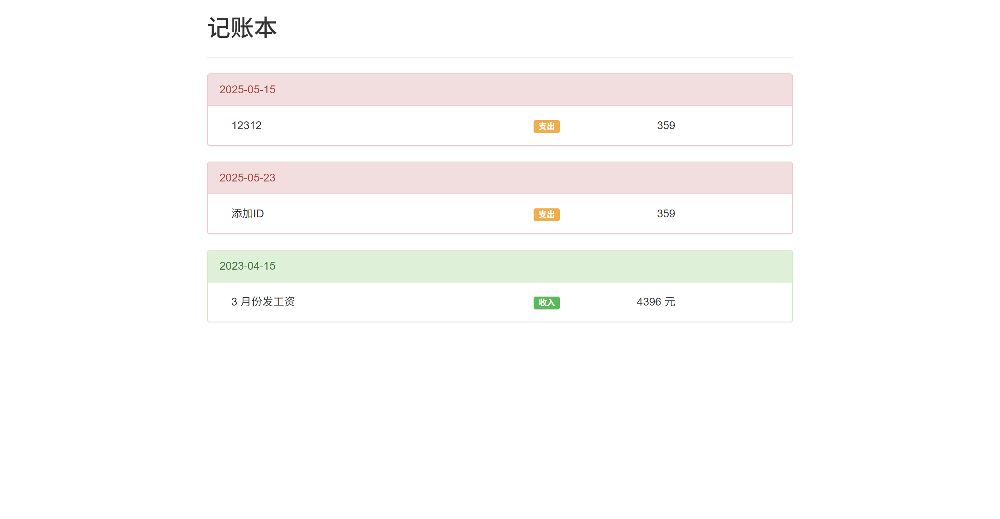
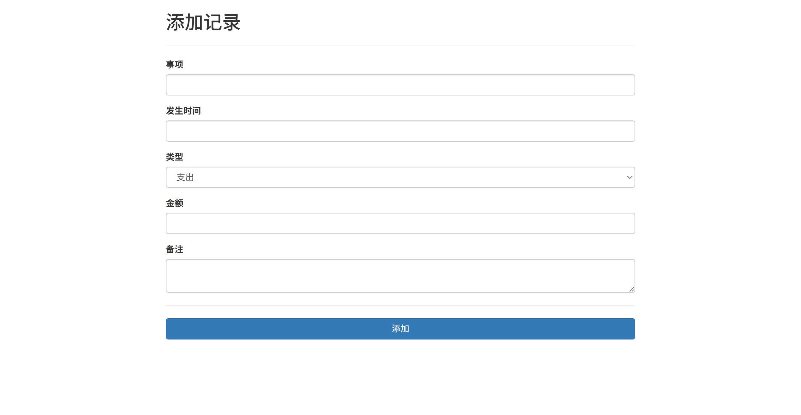
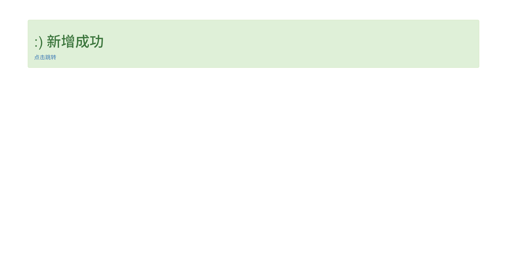
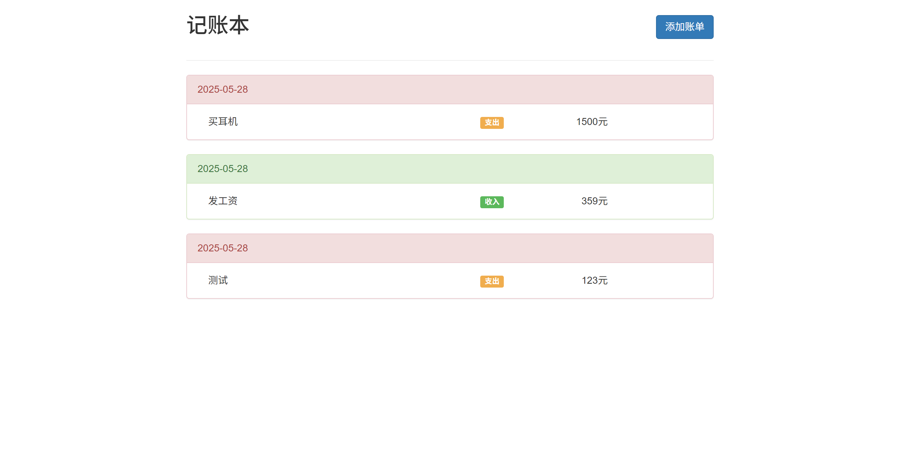

start 设置的为 nodemon 运行, nodemon 安装到本地了,依赖树中没有

## 技术栈

node+express+ejs+mongodb

启动项目的时候优先启动数据库

## 界面样式

http://127.0.0.1:3000/account/create这个需要自己路由跳转,没显示呈现出来

不过在添加成功和删除成功的情况下给了很人性化的回调链接

优化,添加了 MongoDB 作为数据存储的地方同时添加了添加跳转的按钮

